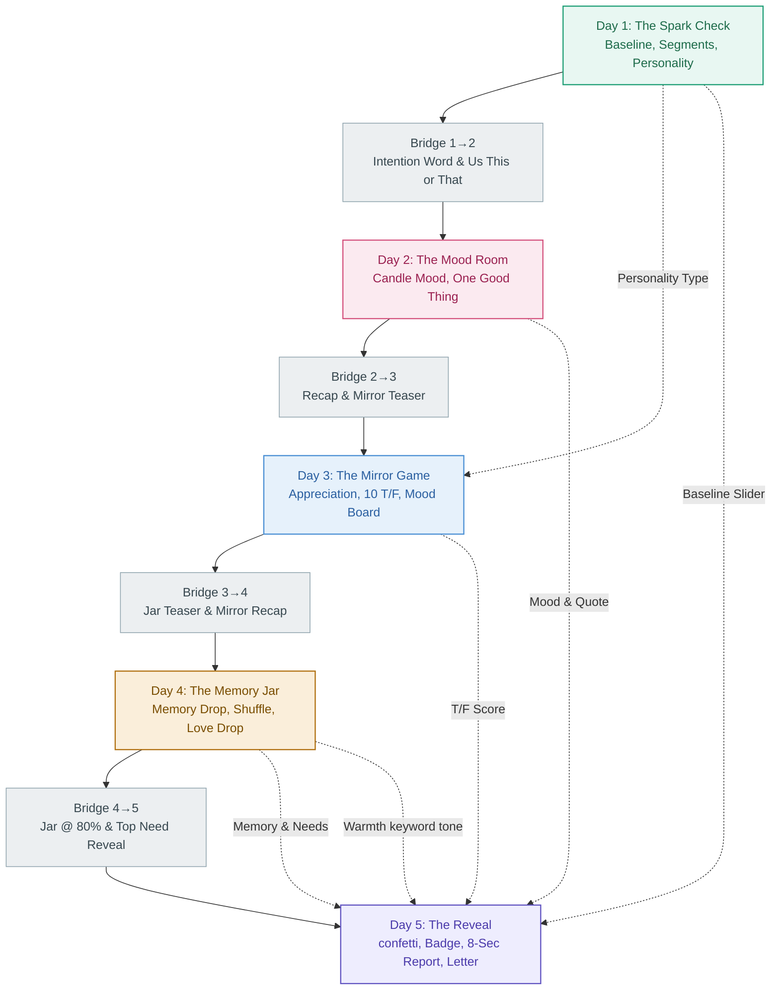

# LDA 5-Day App: Connectivity, Scoring & Algorithm Guide
> **Master Founder & Developer Reference**  
> *A complete structural blueprint mapping how every gesture, slider, tap, and word across the 5-day solo journey quietly builds the Day 5 personalized report, calculates the relationship scores, and drives the partner invite.*

---

## 1. Core Philosophy & Experience Arc

The foundational principle of LDA is **silent personalization through seamless action**. Rather than bombarding users with clinical onboarding or technical personality surveys, the app captures raw emotional data, commitment signals, and communication styles during a 5-day solo journey. 

On **Day 5**, all this background data converges into a stunning personalized reveal:
*   An assigned **Relationship Badge** (calculated from 3 binary personality axes).
*   A **Connection Score** (reflecting baseline feelings, growth, and weekly consistency).
*   A **Week in Moments Vertical Timeline** (restating the user's raw, unedited thoughts).
*   A **Memory Jar** (which visually fills to 100% and unlocks glowing, tappable moments).
*   **Sealed Envelopes and Locked Games** (creating powerful "open loops" that make inviting the partner feel like a natural resolution rather than a sales ask).



---

## 2. Day-by-Day Experience Engine & Activities

Every activity in the app falls into one of three behavioral categories:
*   🟢 **Scoring**: Directly writes numbers to the database to calculate final scores or badge axes.
*   🔵 **Display-Feed**: Captures quotes, choices, or tiles to populate the visible report (no mathematical scoring).
*   🟣 **Experience-Only**: Purely emotional or transitional moments. Nothing is stored; they set psychological warmth.

### Day 1: The Spark Check (Theme: Bold & Fun)
*   **Connection Slider** (🟢 *Scoring* / 🔵 *Display-Feed*): 
    *   *Mechanic*: User drags 1–10 to show how connected they feel.
    *   *Scoring*: Slider value $\times 2$ (up to **20 points** on the Connection Score).
    *   *Badge impact*: Score $\ge 6$ pushes Axis C toward **Protecting (+2)**; score $\le 5$ pushes toward **Building (+2)**.
    *   *Continuity*: Splits user into 1 of 5 emotional segments, determining their custom 7-question Spark Quiz. Stored as baseline for the Day 4 Trend Bonus.
*   **The Honest Moment** (🟣 *Experience-Only*):
    *   *Mechanic*: Pre-written response shown based on the slider score. 4–6 second pause.
    *   *Purpose*: Creates psychological safety, encouraging users to answer the quiz with complete honesty.
*   **Vibe Check (Game 05)** (🟢 *Scoring* / 🔵 *Display-Feed*):
    *   *Mechanic*: Tapping 1 of 8 emoji tiles describing relationship mood.
    *   *Scoring*: Positive (Growing, Hopeful, Energised, Passionate) = **10 pts**; Calm/Quiet (Tender, Quiet) = **7 pts**; Heavy (Tired, Drifting) = **3 pts**.
    *   *Badge impact*: Tender/Quiet $\rightarrow$ **Expressive (+1)** & **Protecting (+1)**; Growing/Hopeful/Energised $\rightarrow$ **Active (+1)** & **Building (+1)**.
*   **Spark Quiz (7 Questions)** (🟢 *Scoring*):
    *   *Mechanic*: Segment-adaptive questions with illustrated cards. Auto-advances.
    *   *Scoring*: Combined to calculate 1 of 4 Personality Types.
    *   *Badge impact*: Q1 and Q6 feed Axis A (+2 per match); Q4 and Q7 feed Axis B (+2 per match); Q5, Q6, and Q7 feed Axis C (+1 per match).
*   **Personality Type Result** (🟢 *Scoring* / 🔵 *Display-Feed*):
    *   *Mechanic*: Displays Steady Flame, Electric Spark, Deep Current, or Shifting Tide.
    *   *Scoring*: Completing Day 1 earns **+1.0 Dedication point**.
    *   *Continuity*: Decides which 10 custom True/False statements are served on Day 3 and tailoring the psychology fact on Day 4.

---

### Bridge 1→2: Re-entry
*   **Streak Ring (Day 2)** (🟣 *Experience-Only*): Welcome back greeting showing Streak 2.
*   **Intention Word Selector** (🔵 *Display-Feed*): Stored and shown as a pill in Bridge 2→3 and on the Day 5 Week in Moments Day 2 Card.
*   **This or That: Us Edition (Game 06)** (🟢 *Scoring* / 🔵 *Display-Feed*):
    *   *Mechanic*: 3 rounds picking scenarios (e.g., Beach vs Trek) and predicting partner's choice.
    *   *Badge impact*: 2+ Adventure picks $\rightarrow$ **Active (+1)**; 2+ Comfort/Home picks $\rightarrow$ **Expressive (+1)**. Predictions match own choices 2+ times $\rightarrow$ **Protecting (+1)**; all predictions differ $\rightarrow$ **Building (+1)**.
    *   *Sealed state*: Stored as an open loop in Section 8 (locked for partner's re-entry).

---

### Day 2: The Mood Room (Theme: Calm & Warm)
*   **Candle Mood Screen** (🟢 *Scoring* / 🔵 *Display-Feed*):
    *   *Mechanic*: Interactive candle animating to an 8-mood selection grid.
    *   *Scoring*: Connected/Loved/Playful = **10 pts**; Grateful/Missed = **6 pts**; Overwhelmed/Frustrated/Distant = **3 pts**.
    *   *Badge impact*: Connected/Playful $\rightarrow$ **Active (+1)** & **Present (+1)**; Loved/Grateful/Missed $\rightarrow$ **Deep (+1)**; Grateful/Loved $\rightarrow$ **Protecting (+1)**; Heavy moods $\rightarrow$ **Building (+1)**.
    *   *Continuity*: Routes user to Happiness, Sadness, or Frustrated follow-up questions.
*   **One Good Thing** (🟢 *Scoring* / 🔵 *Display-Feed*):
    *   *Mechanic*: Write one nice thing about the partner (10–80 chars). Card flies into journal icon.
    *   *Badge impact*: Response $\ge 40$ chars $\rightarrow$ **Expressive (partial signal)**.
    *   *Continuity*: Recapped in exact words on Bridge 2→3 and Day 5 Week in Moments.
*   **The Follow-Up Question** (🟢 *Scoring* / 🔵 *Display-Feed*):
    *   *Mechanic*: Open-text response (optional). Adapts based on Day 2 candle mood and Day 1 quiz.
    *   *Scoring*: Stored as complete mood + follow-up (not skipped) = **+1.0 Dedication point**.
    *   *Badge impact*: Response $\ge 60$ chars $\rightarrow$ **Expressive (+2)** (strongest character signal in app).

---

### Bridge 2→3: Transition
*   **Return & Recap** (🔵 *Display-Feed*): Shows Day 2 mood, One Good Thing quote, and the Mirror Prep Line: *"Yesterday you felt [Mood]. Today we find out how well you actually know them."* Stored Day 3 intention word.

---

### Day 3: The Mirror Game (Theme: Playful & Provocative)
*   **Appreciation Snap** (🟢 *Scoring* / 🔵 *Display-Feed*):
    *   *Mechanic*: "What do you want them to know about you right now?" (1 open sentence).
    *   *Scoring*: Completing = **+0.5 Dedication points**.
*   **Finish My Sentence (Game 02)** (🟢 *Scoring* / 🔵 *Display-Feed*):
    *   *Mechanic*: Pick 1 of 4 illustrated tap cards to complete a sentence stem.
    *   *Scoring*: Completing = **+0.5 Dedication points**.
    *   *Badge impact*: Card tag feeds all 3 axes: *Expressive/Deep* $\rightarrow$ **Expressive (+1)**; *Active/Playful* $\rightarrow$ **Active (+1)**; *Deep/Resilience* $\rightarrow$ **Deep (+1)**; *Present/Playful* $\rightarrow$ **Present (+1)**; *Protective* $\rightarrow$ **Protecting (+1)**; *Building/Active* $\rightarrow$ **Building (+1)**.
*   **Mirror Game (10 T/F Statements)** (🟢 *Scoring* / 🔵 *Display-Feed*):
    *   *Mechanic*: 10 custom statements determined by Day 1 Personality Type. Tap T/F.
    *   *Scoring*: Number of TRUE answers (out of 10) = up to **10 pts** on the Connection Score.
    *   *Badge impact*: $\ge 7$ TRUE $\rightarrow$ **Deep (+2)** & **Protecting (+1)**; $\le 4$ TRUE $\rightarrow$ **Present (+2)**.
*   **Mirror Results - Open Loop** (🟣 *Experience-Only*):
    *   *Mechanic*: Left split-screen shows user's answers; right split-screen is frosted and locked.
    *   *Purpose*: The ultimate conversion hook. Prompts the partner invite to unseal correct answers.
*   **Mood Board Match (Game 07)** (🟢 *Scoring* / 🔵 *Display-Feed*):
    *   *Mechanic*: Select exactly 3 tiles out of 10 describe the relationship this week.
    *   *Scoring*: Stored as positive vs heavy tiles. Number of warm tiles (tagged Present/Protecting) $\div 3 \times 10$ = up to **10 pts** on the Connection Score. Completing = **+0.5 Dedication points**.
    *   *Badge impact*: Feeds all 3 axes simultaneously via the majority tag of the 3 selected tiles.
*   **The One Certainty** (🟢 *Scoring* / 🔵 *Display-Feed*):
    *   *Mechanic*: "Despite what you're unsure about, what is one certainty?" (Open text).
    *   *Scoring*: Completing = **+0.5 Dedication points**. Recapped on Bridge 3→4.

---

### Bridge 3→4: Transition
*   **Return & Recap**: Shows streak 4, Mirror score card, and One Certainty quote. Highlights the mini 5-dot timeline with the Day 4 dot pulsing in amber. Stored Day 4 intention word.

---

### Day 4: The Memory Jar (Theme: Warm & Emotional)
*   **The Memory Jar** (🟢 *Scoring* / 🔵 *Display-Feed*):
    *   *Mechanic*: Jar shown at 60% fill. User drops a Text, Photo, or Emoji memory.
    *   *Scoring*: Dropping memory = **+1.0 Dedication point**.
    *   *Badge impact*: Text $\rightarrow$ **Expressive (+2)**; Photo $\rightarrow$ **Active (+2)**; Emoji $\rightarrow$ **Active (+1)**.
    *   *Continuity*: First 8 words populate the Day 5 personal Letter. First 60 chars recap on Bridge 4→5.
*   **The Tiny Compliment** (🟢 *Scoring* / 🔵 *Display-Feed*):
    *   *Mechanic*: Pick 1 of 8 feeling words or write a custom word (10 chars).
    *   *Scoring*: Tapping = **+0.5 Dedication points**. Stored to glow inside the Day 5 Jar.
*   **Priority Shuffle (Game 08)** (🟢 *Scoring* / 🔵 *Display-Feed*):
    *   *Mechanic*: Rank top 3 relationship needs out of 5 illustrated cards.
    *   *Scoring*: Completing = **+0.5 Dedication points**.
    *   *Badge impact*: "Deeper conversations" in top 3 $\rightarrow$ **Deep (+2)**; "Laughter & lightness" rank 1 $\rightarrow$ **Present (+2)**; "More calm, less stress" in top 3 $\rightarrow$ **Deep (+1)**. Rank 1 Warmth/Calm $\rightarrow$ **Protecting (+2)**; Rank 1 Laughter/Time/Deeps $\rightarrow$ **Building (+2)**.
    *   *Continuity*: Feeds Report Section 4. Teases on Bridge 4→5: *"Day 5 shows you if they felt the same."*
*   **The Daily 2** (🟢 *Scoring* / 🔵 *Display-Feed*):
    *   *Mechanic*: Card 1 (emotion carrying) & Card 2 (weekly lesson) open text.
    *   *Scoring*: Both answered = **+0.5 Dedication points**; one answered = **+0.25**.
    *   *Badge impact*: Both answers $\ge 40$ chars $\rightarrow$ **Expressive +1**.
    *   *Continuity*: Card 1 scanned for emotional keywords to set the Day 4 Mood Bar (Warmth = 7, Heavy = 4, Neutral = 5) and check for the Trend Bonus. Card 2 displayed in Section 5 timeline.
*   **Love Drop & Drop Box (Game 04)** (🟢 *Scoring*):
    *   *Love Drop*: Leave a sealed envelope for partner (preset choices). Earns **+0.5 Dedication points**. Feeds **Expressive +1** (Compliment), **Deep +1** (any use), **Protecting +1** (Compliment/Memory), or **Building +1** (Challenge).
    *   *Drop Box*: Write hard truth, AI reframes it, original deleted. Earns **+0.5 Dedication points**, **Deep +2** (highest in app), and **Building +1**.
*   **Trivia Fact** (🟣 *Experience-Only*): Tailored fact based on Day 1 personality type. Displays 5 seconds.

---

### Bridge 4→5: The Ceremonial Entrance
*   **Streak 5 Ring**: Prominent animation.
*   **Visual Jar**: Displays the jar filled to 80% with the compliment word glowing inside.
*   **Top Need Teaser Card**: Re-exhibits their top need, building massive anticipation for the partner reveal.
*   **Significance Line**: *"Day 5 is the one that matters. Everything you built this week becomes visible today."* No intention word selector.

---

### Day 5: The Reveal (Theme: Bold & Emotional)
*   **confetti & Celebration** (🟣 *Experience-Only*): 5-pip fill animation and multi-color confetti.
*   **Badge & Score Calculation** (🟢 *Scoring*): Silently processes all accumulated data to calculate the badge and scores.
*   **The Promise** (🟢 *Scoring* / 🔵 *Display-Feed*):
    *   *Mechanic*: "One honest intention you want to carry forward."
    *   *Scoring*: Completing = **+1.0 Dedication point** (last chance to push the user into the Gold badge tier).
*   **The Personalized Letter** (🔵 *Display-Feed*): Template generated from Name, Slider baseline, Personality Type, and Day 4 Memory words.
*   **Partner Invite** (🟣 *Experience-Only*): Generates a custom invitation link. If rejected, redirects to Solo Daily habit loop (resets jar for Week 2).

---

## 3. The 3 Binary Axes & The 8 Badge Matrix

At the moment Day 5 loads, the app tallies all scoring signals across three independent binary axes. 

```
                                  [ AXIS A ]
                            Expressive vs Active
                                     |
                 +-------------------+-------------------+
                 |                                       |
             [ AXIS B ]                              [ AXIS B ]
           Deep vs Present                         Deep vs Present
                 |                                       |
         +-------+-------+                       +-------+-------+
         |               |                       |               |
     [ AXIS C ]      [ AXIS C ]              [ AXIS C ]      [ AXIS C ]
    Prot vs Build   Prot vs Build           Prot vs Build   Prot vs Build
         |               |                       |               |
   Warm Keeper    Honest Architect         Quiet Strength  Steady Climber
         |               |                       |               |
   Joyful Anchor   Curious Lover           Spark Keeper   Intentional Partner
```

### The Tally Matrix

| Axis | Left Endpoint | Right Endpoint | Primary Signals & Weight | Tie-Breaker (Day 1) |
| :--- | :--- | :--- | :--- | :--- |
| **Axis A** | **Expressive** | **Active** | **Text Memory**: Exp +2<br>**Follow-Up length $\ge 60$**: Exp +2<br>**Daily 2 length $\ge 40$**: Exp +1<br>**Compliment Drop**: Exp +1<br>**Photo Memory**: Act +2<br>**Us This/That Adventure**: Act +1<br>**Emoji Memory**: Act +1 | **Quiz Q1**<br>Answer A = Expressive<br>Answer B = Active |
| **Axis B** | **Deep** | **Present** | **Mirror Game TRUE $\ge 7$**: Deep +2<br>**Drop Box use**: Deep +2<br>**Conversations Shuffle**: Deep +2<br>**Love Drop use**: Deep +1<br>**Mirror Game TRUE $\le 4$**: Present +2<br>**Laughter Shuffle (Top)**: Present +2 | **Quiz Q7**<br>Answer B = Deep<br>Answer A = Present |
| **Axis C** | **Protecting** | **Building** | **Baseline Slider $\ge 6$**: Prot +2<br>**Shuffle Warmth/Calm (Top)**: Prot +2<br>**Predictions match picks 2+**: Prot +1<br>**Mirror Game TRUE $\ge 7$**: Prot +1<br>**Baseline Slider $\le 5$**: Build +2<br>**Shuffle Laughter/Time/Deeps**: Build +2<br>**Predictions differ**: Build +1<br>**Drop Box use**: Build +1 | **Slider Score**<br>Score $\ge 6$ = Protecting<br>Score $\le 5$ = Building |

> [!IMPORTANT]
> If all tie-breakers fail, the system assigns **The Intentional Partner (Active + Present + Building)** as the default fallback.

### The 8 Badge Profiles

| Badge Name | Axis A | Axis B | Axis C | Trait Pills | Report Description |
| :--- | :--- | :--- | :--- | :--- | :--- |
| **The Warm Keeper** | Expressive | Deep | Protecting | Words · History · Safety | *"You love loudly in the quiet moments and guard what you've built."* |
| **The Honest Architect** | Expressive | Deep | Building | Truth · Vision · Rebuilding | *"You use your words as tools — to name what's broken and build what's missing."* |
| **The Joyful Anchor** | Expressive | Present | Protecting | Laughter · Comfort · Safe Haven | *"You keep things light, keep things close, make ordinary moments feel like enough."* |
| **The Curious Lover** | Expressive | Present | Building | Reaching · Play · Discovery | *"You are always reaching — for the next conversation, the next version of this relationship."* |
| **The Quiet Strength** | Active | Deep | Protecting | Actions · Legacy · Unspoken | *"You don't say it — you do it. What you've built speaks louder than words."* |
| **The Steady Climber** | Active | Deep | Building | Purpose · Patience · Foundation | *"You move slowly and with purpose. Every action is intentional. You're building something that lasts."* |
| **The Spark Keeper** | Active | Present | Protecting | Energy · Action · Nurturing | *"You make things happen. You keep the energy alive — and you do it so naturally nobody notices the work."* |
| **The Intentional Partner**| Active | Present | Building | Choice · Presence · Effort | *"You are here on purpose. You chose this, showed up, and kept going."* |

---

## 4. Day 5 Scoring System & Equations

The backend generates three distinct scores. Each score uses specific math, normalization, and capping rules:

```
Connection Score (100) = Day 1 Slider (20) + Day 1 Vibe (10) + Day 2 Mood (10) + Day 3 Mood Board (10) + Day 3 Mirror (10) + Dedication (30) + Trend Bonus (10)
```

### 1. Connection Score (/100)
A composite index capped at 100 points, derived from 7 weekly checkpoints:

$$\text{Connection Score} = \min(100, S_1 + V_1 + M_2 + MB_3 + MG_3 + D_{\text{contrib}} + T_{\text{bonus}})$$

Where:
*   **$S_1$ (Slider Baseline)**: Dragged score (1–10) multiplied by 2. Capped at **$20\text{ pts}$**.
*   **$V_1$ (Vibe Check)**: Growing / Hopeful / Energised / Passionate = **$10\text{ pts}$**; Tender / Quiet = **$7\text{ pts}$**; Tired / Drifting = **$3\text{ pts}$**.
*   **$M_2$ (Day 2 Mood)**: Connected / Loved / Playful = **$10\text{ pts}$**; Grateful / Missed = **$6\text{ pts}$**; Overwhelmed / Frustrated / Distant = **$3\text{ pts}$** *(Normalised from raw candle values $9, 6, 3$)*.
*   **$MB_3$ (Mood Board)**: Count of selected tiles carrying a *Present* or *Protecting* tag $\div 3 \times 10$. (e.g., 2 warm tiles = **$6.7\text{ pts}$**; 3 warm tiles = **$10\text{ pts}$**).
*   **$MG_3$ (Mirror Game)**: Count of TRUE answers in the True/False quiz. Capped at **$10\text{ pts}$**.
*   **$D_{\text{contrib}}$ (Dedication Contribution)**: Stems from the Dedication Score ($D \div 7 \times 30$). Capped at **$30\text{ pts}$**.
*   **$T_{\text{bonus}}$ (Trend Bonus)**: Compare Day 4 Card 1 keyword tone to Day 1 slider score baseline:
    *   Day 4 tone is emotionally warmer than Day 1 = **$+10\text{ pts}$**.
    *   Day 4 tone is equal to Day 1 = **$+5\text{ pts}$**.
    *   Day 4 tone is lower than Day 1 = **$0\text{ pts}$**.

---

### 2. Dedication Score (/7)
Measures commitment and task completion. The raw tally can reach up to **9.5 points**, but is strictly capped at **7.0**. 

$$\text{Dedication Score} = \min(7.0, D_{\text{tasks}} + \text{Streak Bonus})$$

#### Raw Points Matrix:
*   **Day 1 Complete**: Finished all required activities = **$+1.0\text{ pt}$**
*   **Day 2 Complete**: Mood Candle + Follow-Up Question answered (not skipped) = **$+1.0\text{ pt}$**
*   **Day 3 Tasks**:
    *   Appreciation Snap completed = **$+0.5\text{ pt}$**
    *   Finish My Sentence (G02) completed = **$+0.5\text{ pt}$**
    *   Mood Board Match (G07) completed = **$+0.5\text{ pt}$**
    *   One Certainty completed = **$+0.5\text{ pt}$**
*   **Day 4 Tasks**:
    *   Memory Jar (any type dropped) = **$+1.0\text{ pt}$** (Highest single D4 task point)
    *   Tiny Compliment completed = **$+0.5\text{ pt}$**
    *   Priority Shuffle (G08) completed = **$+0.5\text{ pt}$**
    *   Daily 2: Both answered = **$+0.5\text{ pt}$**; One answered = **$+0.25\text{ pt}$**
    *   Love Drop or Drop Box used = **$+0.5\text{ pt}$** each (Max **$+1.0\text{ pt}$**)
*   **Day 5 Task**:
    *   The Promise completed = **$+1.0\text{ pt}$**
*   **Streak Bonus**:
    *   Skip feature was never triggered across the entire week = **$+1.0\text{ pt}$**

#### Badge Tiers:
The final capped Dedication Score determines the physical ring visual enclosing the relationship badge:
*   **Gold Tier**: $6.0 \le \text{Score} \le 7.0$ ( Confetti burst + gold ring border).
*   **Standard Tier**: $4.0 \le \text{Score} \le 5.9$ ( Silver ring border).
*   **Emerging Tier**: $2.0 \le \text{Score} \le 3.9$ ( Soft bronze/emerging styling).

---

### 3. Partner Knowledge Score (/10)
Directly measures how well the user understands their partner.
*   **Solo Mode**: Defaults to the user's TRUE count (out of 10) in the Day 3 Mirror Game.
*   **Couple Mode Recalibration**: The only score in the app that remains fluid. When the partner registers and answers their own Day 3 self-evaluations, this score recalculates:

$$\text{Partner Knowledge Score} = \left(\frac{\text{Total Matches}}{\text{10 Statements}}\right) \times 10$$

---

## 5. The 8-Section Report Card Map

On Day 5, the scrollable report card loads with eight distinct cards. Each card reads data from a specific day:

```
[Day 5 Report Card]
 ├── Section 1: Mood Journey --------> Feeds from Days 1, 2, 4 (Keyword Tone)
 ├── Section 2: Emotional Weather ----> Feeds from Day 1 Vibe, Day 2 Candle, Day 3 Theme
 ├── Section 3: Personality Type ------> Feeds from Day 1 Quiz
 ├── Section 4: Relationship Needs ----> Feeds from Day 4 Priority Shuffle
 ├── Section 5: Week in Moments -------> Feeds from raw text (Days 1–4)
 ├── Section 6: Memory Jar -------------> Feeds from jar assets, glowing compliment
 ├── Section 7: Badge Reveal ----------> Feeds from 3-Axis & Dedication Score
 └── Section 8: Couple Unlock ----------> Feeds from status of sealed games
```

*   **Section 1 — Mood Journey Chart**: Shows a 5-bar vertical chart. Day 1 = Slider baseline. Day 2 = Candle Mood score. Day 3 = Average of Day 1 and 2 (no mood tracked). Day 4 = Keyword scanner score from Daily 2. Day 5 = Running average of Days 1–4. Inserts a custom trend line below it (e.g., Dip-then-recovery).
*   **Section 2 — Emotional Weather**: Combines three days of visual tiles side-by-side: Day 1 vibe tile, Day 2 candle mood icon, and Day 3 Mood Board theme name. 
*   **Section 3 — Personality Type Deep Dive**: Displays the Day 1 Personality Type with a full structural context (3 strengths, 1 developmental growth challenge).
*   **Section 4 — Your Relationship Needs This Week**: Sourced entirely from the Day 4 Priority Shuffle. Shows the top pick and ranked items. Holds the partner's slot as frosted and sealed.
*   **Section 5 — Week in Moments (Timeline)**: A beautiful vertical diary. Exhibits their raw, unedited text entries. Skipping an activity triggers a placeholder card encouraging next-week consistency.
*   **Section 6 — Memory Jar Full Reveal**: Animates the jar to 100% fill. Clicking notes opens lightboxes showing dropped text, emoji, or photo assets. Displays specialized rose notes (Drop Box) or gold-sealed notes (Love Drop).
*   **Section 7 — Your Badge**: Highlights the badge logo, trait pills, ring styling (Gold/Standard/Emerging), and provides the shareable card export.
*   **Section 8 — Couple Mode Unlock**: Lists four frosted blocks outlining exactly what games (prediction game, sentence stem, this/that predictions) are sealed and waiting for the partner.

---

## 6. The Segment Journey: The Day 1 Slider Cascade

The score selected on the Day 1 Connection Slider is the single most impactful input in the experience. It divides users into 1 of 5 emotional segments, triggering a cascading personalized flow:

```
[Slider Score]
  ├── (1-2) ---> Segment: Quiet Crisis -------> Quiz: Lonely/Courage -> D2 follow-up
  ├── (3-5) ---> Segment: Slow Drift -----------> Quiz: Routine/Wants -> D2 follow-up
  ├── (6-7) ---> Segment: Good Place -----------> Quiz: shared language -> D2 follow-up
  ├── (8-9) ---> Segment: Strong Foundation ----> Quiz: honests/conflict -> D2 follow-up
  └── (10) ----> Segment: Perfect 10 (Examined) -> Quiz: true cost of 10 -> D2 follow-up
```

### The Segment Progression Map

| Baseline Slider | Emotional Segment | Custom Quiz Focus | Custom Honest Moment copy | Day 3 T/F Statement Set | Day 5 Weather Pattern reads |
| :--- | :--- | :--- | :--- | :--- | :--- |
| **1–2** | **The Quiet Crisis** | Loneliness, survival, courage, what broke down. | *"Most people wouldn't admit this. You just did. That takes courage — and it's exactly why you're here."* | Custom set dealing with repair, early hope, and effort. | Mixed pattern: *"You came in in crisis, but you showed up. That's reconstruction."* |
| **3–5** | **The Slow Drift** | Routine, replacement of conversations, quiet drift. | *"Most people open this app at a 5. You opened it at [N]. That's honest. Let's work with that."* | Custom set exploring silent boundaries and unspoken routine gaps. | Heavy opening, warm close: *"You began in the drift and landed in safety. Growth is real."* |
| **6–7** | **The Good Place** | Shared language, growth vectors, preservation. | *"Most people open at a 5. You opened at [N]. You're doing better than you think — we'll hold it there."* | Custom set focusing on daily noticing, small appreciations, and shared context. | All-warm week: *"Your week felt grounded and consistent. Safe ground."* |
| **8–9** | **The Strong Foundation** | Comfort zones, conflicts, mutual admiration. | *"[N] out of 10. You're here because you want to protect something good. That's smart."* | Custom set highlighting future dreams, shared secrets, and inner worlds. | All-warm week: *"A rare, solid foundation. You're building from high ground."* |
| **10** | **The Perfect Ten** | True cost of perfect, emotional fatigue, honesty corners. | *"10. Either things are genuinely perfect — or you're being very kind to yourself. Either way, let's begin."* | Custom set evaluating emotional disclosures and whether "perfect" is healthy. | Heavy close: *"A perfect ten is a high standard. Be gentle when the weather shifts."* |

---

## 7. Conversion Architecture & Open Loops

The app is structurally engineered to **incentivize the partner invite** by leaving emotional open loops. Solo actions naturally generate locked cards that can only be unlocked when both partners are present.

### The 4 Sealed Game Loops

1.  **Game 06 (This or That Prediction)**: The user makes three picks and predicts three partner selections. On Day 5, this stands locked: *"Predictions sealed. 3 matches waiting."*
2.  **Game 02 (Finish My Sentence)**: The user completes a sentence stem using an illustration card. The partner's card remains frosted and locked directly beside theirs in the vertical timeline.
3.  **Game 01 (The Prediction Game)**: Locked preview in Section 8. Indicates that partner's arrival is required to start.
4.  **Game 03 (Us vs The Question)**: Locked preview in Section 8. A direct card game waiting for Couple Mode.

```
       [ SOLO EXPERIENCE ]
  User makes predictions & choices
                 |
                 v
       [ DAY 5 REPORT CARD ]
  Visual "Frosted/Locked" screens
                 |
                 v
      [ REASON TO REGISTER ]
  "I want to see what they picked"
                 |
                 v
      [ PARTNER INVITE ACTION ]
  WhatsApp message sent with unique link
```

### The Sealed Love Drop vs Drop Box
*   **The Love Drop (Sealed Envelope)**: When the user drops a sealed compliment, memory, or challenge, the system generates a glowing **gold sealed envelope** in the Day 5 Memory Jar labeled *"Something waiting for them."* The solo user cannot open it again; it only unseals on the partner's screen once they install and register, creating a highly personal gift hook.
*   **The Drop Box (AI Reframe)**: When a user writes a difficult relationship stressor, the app's local AI reframes the statement into constructive words. The original text is **deleted immediately**. In the Day 5 jar, this appears as a **rose envelope** labeled *"Something you found the words for."* Its contents cannot be viewed by either partner—honoring the raw emotional work while preserving total privacy.

---

## 8. Actionable Gaps & Developer Checklist
*(Founder priorities from `lda_master_connectivity.html` to be addressed in upcoming dev sprints)*

### ⬜ Dev Task 1: Inter-Week Mood Continuity (Visible Arc)
*   **The Issue**: The 5-day mood chart is calculated and shown on Day 5—but the user has no visual sense of their emotional arc *while* they're in it (Days 2–4).
*   **Solution**: Implement a subtle, always-visible **"emotional pulse"** in the app header that grows in detail across the days, letting users feel the arc building before Day 5.

### ⬜ Dev Task 2: Segment Identity Mid-Week Reflector
*   **The Issue**: The user is placed in an emotional segment on Day 1 but never told what segment they're in. The Personality Type is revealed, but the emotional starting point is not explicitly named.
*   **Solution**: Add a soft, non-clinical acknowledgement on Day 2 or 3 that references where they started—e.g., *"You came in feeling like things needed work. Look what three days of showing up feels like."*

### ⬜ Dev Task 3: Complete Personality Type Personalization
*   **The Issue**: After the Day 1 type determination, personalization happens in Day 3 Mirror Game questions and Day 4 Trivia—but the Bridge 3→4 quote, the Bridge 4→5 Significance Line, and several Day 5 insight lines are still generic.
*   **Solution**: Write a dictionary of **type-adaptive phrases** and map them to Bridge 3→4, Bridge 4→5, and the Day 5 personalized letter.

### ⬜ Dev Task 4: Daily 2 Keyword Scanner Visibility
*   **The Issue**: The Day 4 journal entry (Card 1) is scanned for warmth vs heavy keywords to set the D4 bar on the mood chart and determine the Trend Bonus. The user has no idea this is happening.
*   **Solution**: Surface this gently on Day 5: *"The way you described Day 4 felt warmer than how you described Day 1."*

### ⬜ Dev Task 5: Segment-Adaptive Bridge Quotes
*   **The Issue**: All 4 bridge quotes are the same for all users regardless of their segment, personality type, or preceding day's activity.
*   **Solution**: Map **3 variations per bridge** that dynamically adapt to the user's emotional segment or recent mood pattern.

### ⬜ Dev Task 6: Expanded Mapped Weather Patterns
*   **The Issue**: The Emotional Weather section in the Day 5 report currently has 4 pre-written pattern reads. The actual combinations possible across 3 inputs (Day 1 vibe, Day 2 mood, Day 3 theme) run into dozens.
*   **Solution**: Map at least **12 distinct combinations** with specific, highly tailored language to maximize the "they know me" feeling.

---

> [!TIP]
> **Implementation Note for Engineers**: Ensure the calculations for `Connection Score` and `Dedication Score` are processed as a single Transaction on Day 5 re-entry to prevent mismatched totals if a user fills the Promise *after* the initial Confetti screen loads.

---
**LDA 5-Day Activity & Connectivity Map · Product Reference Document**
